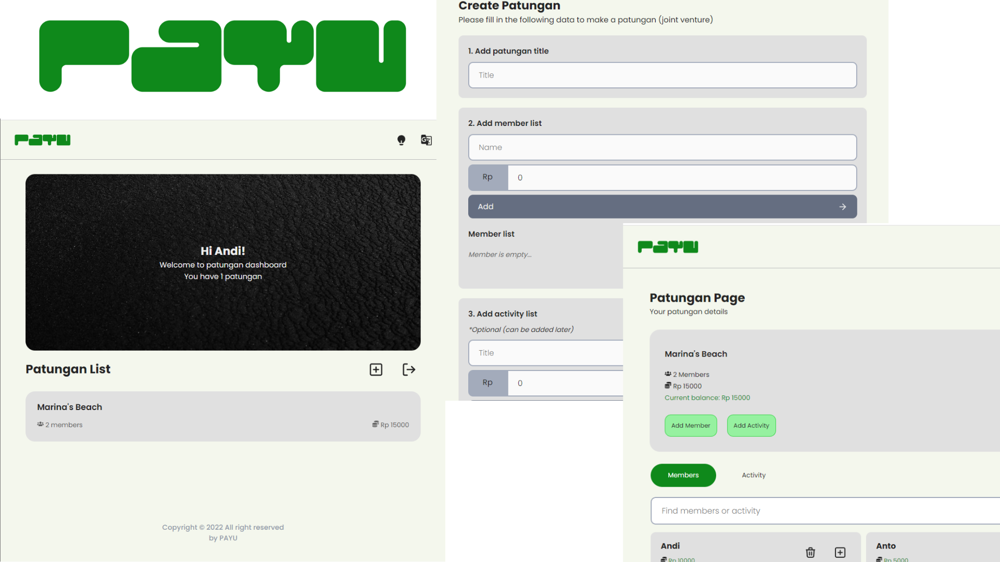

# 
PAYU (Patungan Yuk)

PAYU merupakan aplikasi pencatatan patungan yang dibangun guna memberi kemudahan bagi mereka yang ingin pergi berlibur ataupun sekedar hangout akan tetapi tetap memperhatikan budget/dana sehingga dapat tercatat setiap pemasukan dan pengeluarannya. Terdapat fitur untuk membuat grup patungan, memasukkan daftar anggota beserta jumlah dana dari setiap anggota, dan menambah daftar kegiatan apa saja yang ingin dilakukan. Dengan adanya aplikasi ini diharapkan dapat membantu pengguna agar perencanaan dan pengelolaan dana menjadi lebih baik.

 

## Team C22-133

## Daftar anggota
| ID        | Nama                  | Github & LinkedIn                                                
| --------- | --------------------- | ----------------------------------------------------------------
| R248X0516 | Aldo Wijaya           | 
| R291X0705 | Hifki Yuda Pratama    | 
| R248X0527 | Muhammad Bachtiar     | 
| R248X0538 | Satria Berliano Manzi | 

## Tema aplikasi
Solusi Aplikasi Utilitas

## Executive Summary
Kehidupan masyarakat setelah pandemi Covid-19 mulai berjalan normal, kembali ke aktivitas dan kegiatan sehari-hari. Tidak sedikit dari mereka yang mulai melepaskan hasratnya untuk pergi berlibur ataupun sekedar hangout dengan teman atau pasangan. Hal tersebut membutuhkan sebuah perencanaan keuangan yang tepat. Kami membangun sebuah aplikasi utilitas yang mengusung konsep patungan, sehingga dapat menjaga status keuangan dan mengatur pengeluaran terutama bagi mereka yang ingin pergi bersama-sama.

## Fitur dari aplikasi PAYU
* Mengelola patungan dengan mudah
* Akumulasi dan sisa patungan ditampilkan secara otomatis
* Share patungan untuk memudahkan anggota

## Project Resources
#### 1. Bahasa Pemrograman

#### 2. Library

#### 3. Database & Deployment

#### 4. Wireframe & Prototyping

#### 5. API
[Unsplash Image API](https://unsplash.com/developers)

#### Kunjungi aplikasi PAYU [disini](https://patungan-yuk-dicoding.web.app)

--<a href="#readme-top">back to top</a>--

